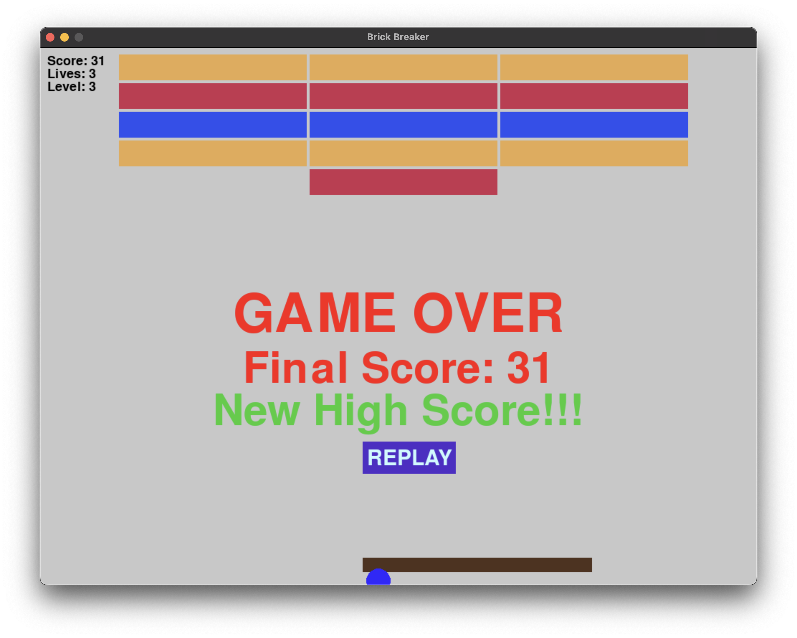

# Brick Breaker Game
This is a simple implementation of the classic Brick Breaker game using Pygame.

## Prerequisites
- Python 3.x: The game is written in Python 3. Make sure you have it installed on your system.

- Pygame: Pygame is a set of Python modules designed for writing video games. You can install it using pip: `pip install pygame`.

## How to Run the Game
1. Clone the repository: `git clone https://github.com/Zubs/BrickBreakerChallenge`.
2. Navigate to the repository: `cd BrickBreakerChallenge`.
3. Run the main.py file: `python main.py`.

## Files
- `ball.py`: This file contains the Ball class. The ball's position, movement, and display on the screen are handled in this class.
- `brick.py`: This file contains the Brick class. The bricks' position, movement, and display on the screen are handled in this class.
- `button.py`: This file contains the Button class. The buttons' position, movement, and display on the screen are handled in this class.
- `highscore.py`: This file contains the HighScore class. The highscore's position, movement, and display on the screen are handled in this class.
- `level.py`: This file contains the Level class. The level's position, movement, and display on the screen are handled in this class.
- `main.py`: This is the main file where the game loop is implemented. It initializes the game objects like the paddle, ball, and bricks. It also handles the game mechanics like paddle movement, ball movement, and collision detection.
- `paddle.py`: This file contains the Paddle class. The paddle's position, movement, and display on the screen are handled in this class.
- `position.py`: This file contains the Position class. The position's position, movement, and display on the screen are handled in this class.
- `text.py`: This file contains the Text class. The text's position, movement, and display on the screen are handled in this class.
- `velocity.py`: This file contains the Velocity class. The velocity's position, movement, and display on the screen are handled in this class.

## Game Objects
- `Paddle`: The paddle is controlled by the player to bounce the ball and prevent it from falling off the screen. The paddle can move left or right.
- `Ball`: The ball moves around the screen, bouncing off the walls and the paddle. The ball's movement and collision mechanics are handled in this class.
- `Bricks`: The bricks are the targets in the game. The player's goal is to break all the bricks by hitting them with the ball.

## Game Mechanics
- `Paddle Movement`: The paddle can move left or right. The movement is controlled by the player. Use the arrow keys on your laptop to move left or right.
- `Ball Movement`: The ball moves in a straight line until it hits a wall, the paddle, or a brick. When the ball hits a wall or the paddle, it bounces back. When the ball hits a brick, the brick is destroyed and your score increases, and the ball bounces back.
- `Game Over`: The game ends when the ball hits the bottom of the screen. A game over message is displayed, and the player is given the option to replay the game. A new high score message is displayed if the score makes the top 5 high scores list.
- `Pause/Resume`: The game can be paused by pressing the space bar. Pressing the space bar again will resume the game.

## Screenshots

